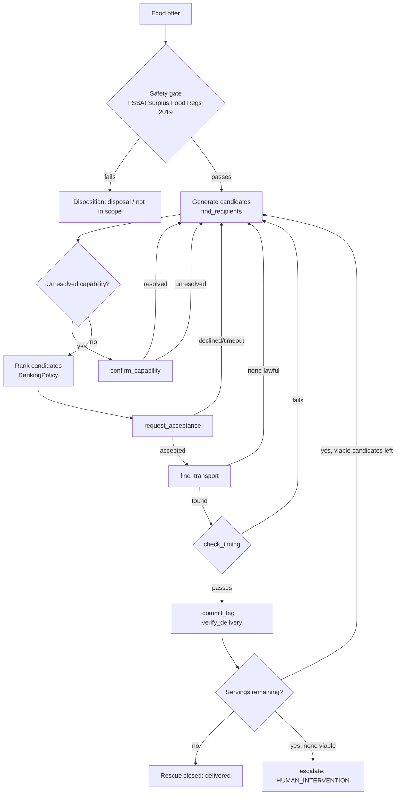

# RescueWindow

An autonomous agent that coordinates surplus-food rescue before the food's safe handoff window closes.

Surplus food appears — an event caterer with 40 untouched meals, a restaurant closing, a
grocery overstock — and the agent works out who can lawfully take it, whether a driver can
get it there before the safety window closes, and only asks a human when no safe autonomous
plan is left.

## What it does

1. A food **offer** arrives (quantity, food type, consumption deadline, donor details).
2. A **deterministic safety gate** decides eligibility — not the agent. It is grounded in
   India's *Food Safety and Standards (Recovery and Distribution of Surplus Food)
   Regulations, 2019* (FSSAI), with every rule tagged with its clause reference (see
   [Safety design](#safety-design-not-vibes) below).
3. The **coordinator** generates candidate recipients, ranks them, requests acceptance,
   arranges compliant transport, and verifies delivery — replanning from current state on
   every failure (a declined offer, an unresolved capability, no lawful vehicle) rather than
   walking a fixed fallback list.
4. If no lawful, autonomous plan exists before the deadline, it **escalates to a human** with
   the reason, the options, and the regulation clause behind the block — instead of guessing.
5. Every run emits an **append-only event log** with timestamps, policy references, and
   decision-point flags. The operations console (`ui/console.html`) replays that log directly
   — there is no separate UI-authored narrative.

## Architecture



The coordinator (`backend/coordinator.py`) never mutates the world directly. Tools
(`backend/tools.py`) emit events; the simulator (`backend/simulation.py`) applies them; the
next reasoning cycle sees the updated state. That is what makes replanning genuine rather
than a scripted branch — see [`Coordinator._attempt_one_leg`](backend/coordinator.py) and the
acceptance checks in [`run_demo.py`](backend/run_demo.py).

Ranking sits behind a swappable `RankingPolicy` (`backend/coordinator.py`):
`DeterministicPolicy` (capacity, then proximity) is the default because the evaluation set
needs reproducibility; `StrandsPolicy` is the seam where a Strands/Bedrock agent drops in to
rank candidates without touching the gates or the loop — it can reorder viable candidates,
but it cannot make an ineligible one eligible, and every choice still passes back through the
deterministic safety gate before anything commits.

## Safety design: not vibes

The LLM plans rescues. It does not decide safety. `backend/safety_policy.py` is a
self-contained deterministic module the agent cannot override, and every rule declares its
origin:

- **`REGULATION`** — stated in the FSSAI Surplus Food Regulations, 2019 gazette, with the
  clause cited (e.g. `Sch. I, 2(6)`: recipient refrigerator must stay below 7°C, cleaned
  weekly).
- **`PROJECT_POLICY`** — our own operating choice, used only where the regulation is silent
  (e.g. the 30-minute handover safety margin before the consumption deadline — the regulation
  defers that number to the Food Authority and sets none itself).

A completed rescue's event log mirrors the twelve `SCHEDULE_II_FIELDS` the regulation
requires distribution organisations to record — so the observability layer and the compliance
record are the same artifact, not two separate things to maintain.

## Data honesty: three layers, never mixed

- **`backend/data/organizations.json`** — real organisation names, **sourced facts only**,
  never capabilities. Currently one entry (Robin Hood Army's Kolkata chapter) that could
  actually be substantiated from public pages; it is not used by the agent at all — citation
  material only. FSSAI's Indian Food Sharing Alliance (IFSA) directory lists roughly 82
  agencies across 90+ cities, so expect single digits per city, not dozens — the file's
  `_README.TODO_FOR_BUILDER` explains how to extend it without breaking the boundary below.
- **`backend/data/recipient_profiles.json`** — anonymous IDs (`recipient_001`, ...) with
  **simulated** capabilities, explicitly marked `SIMULATED`. A capability is `true`, `false`,
  or `"unknown"` — tri-state, never a silent `true`. `registry.py` collapses `unknown` to
  `False` at the safety gate (so it can never let a plan through) while separately reporting
  it as `pending_confirmation`, so the agent's trace distinguishes "this recipient cannot"
  from "we don't know yet."
- **`backend/data/scenario_seeds.json`** — anonymous IDs only, describing simulated dynamic
  world state (who accepts, who declines, who never replies). `registry._assert_anonymous`
  raises if a real organisation name ever appears as a scenario key — a structural guarantee,
  not a rule to remember, so a public repo can never end up with a file that reads as a named
  charity refusing food.

**Recipient identity and directory data are real. Message delivery, response behaviour, and
operational capabilities are simulated for this demo.** That boundary is load-bearing and
intentional — see `backend/data/*.json`'s `_README` blocks for the reasoning.

## Human-intervention metric

> **Human intervention** = a decision boundary is reached, **and** evidence does not
> determine a safe action, **and** no viable autonomous plan remains.

Gathering information (asking a recipient to confirm a capability) is not an intervention.
An unresolved answer eliminates that candidate and triggers a replan — it only becomes an
intervention if the replan finds nothing else viable. See the terminal rule and its rationale
in `backend/coordinator.py`'s module docstring.

Running the three hand-authored demo seeds today:

```
Scenarios completed without a human decision: 2 of 3
Human interventions per decision point: 1 of 15 (6.7%)
Servings delivered: 80 of 120
Replans: 10
```

At n=3, report the raw fraction, not a percentage dressed up as a rate — `Metrics.render()`
says so explicitly. A larger generated evaluation set (varying quantity, deadline pressure,
perishability, response patterns, driver availability) is the natural next step and is not
yet built — see [Limitations](#limitations--whats-not-built).

## Running it

Requires only the Python 3 standard library — no dependencies to install.

```bash
cd backend
python run_demo.py
```

This runs all three seeded scenarios through the identical coordinator, prints the full event
trace, aggregate metrics, and six architectural acceptance checks (recipient rejection
handled, unresolved capability handled, transport failure handled, replanning occurred, at
least one correct escalation, at least one fully autonomous completion).

### Operations console

`ui/console.html` is self-contained (opens directly from the filesystem, no server required)
and replays the same event log the coordinator emits — nothing in the UI is hand-authored
narrative. To regenerate it after changing the coordinator, data, or seeds:

```bash
cd backend
python export_console_data.py      # writes backend/console_data.json
cd ..
python build_console.py            # injects it into ui/console_template.html -> ui/console.html
```

## Limitations / what's not built

Deliberately out of scope for this build (see the design discussion this project grew out
of): a fancy map UI, a multi-agent split (one coordinator agent is sufficient — the judging
criterion is orchestration quality, not agent count), live WhatsApp/SMS integration, real
outreach to real organisations, optimization algorithms, dozens of recipients.

Not yet built: a live Strands/Bedrock-backed `StrandsPolicy` (the seam exists in
`coordinator.py` but currently falls back to the deterministic ranker), the 30-scenario
generated evaluation set (only the 3 hand-authored seeds exist today), and a hosted live demo
deployment.

## License

Apache License 2.0 — see [LICENSE](LICENSE).
